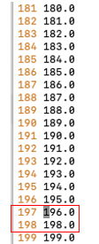

# Troubleshooting - Metadata Enrichment - Profiling
## Prods 

```
$ oc get pod | grep mde
wkc-mde-service-manager-78d674c7d4-x5l4z                     1/1     Running     0               26d

$ oc get pods | grep "wdp-profiling-"
wdp-profiling-66f8475bb8-fgblj                               0/1     Running                 985        15d
wdp-profiling-7675464d6d-9lmjl                               0/1     Running                 2629       40d

$ oc get pod | grep wkc-term-assignment 
wkc-term-assignment-5698b87dbc-f5skx                         1/1     Running     0               27d

Also "finley-public*" pods
jobs-api* pods
asset_files* pods
```

## Logs
Get all profiling related appliction logs from each `wdp-profiling` pods
```
$ oc rsh <wdp-profiling-*> bash
bash-4.4$ cd /logs
bash-4.4$ ls -l

total 1024
-rw-r-----. 1 1000650000 root 329937 Oct 18 19:45 messages.log
-rw-r-----. 1 1000650000 root 349125 Oct 18 19:45 trace.log

$ oc rsync <wdp-profiling-*>:logs ./logs 
```
Get all Spark related appliction logs from `spark-hb-control-plane` pod
```
$ oc rsh <spark-hb-control-plane> bash
bash-4.4$ cd /logs
bash-4.4$ ls -l

total 1024
-rw-r-----. 1 1000650000 root 329937 Oct 18 19:45 messages.log

$ oc rsync spark-hb-control-plane-5b5d97bff5-mk4vm:logs ./logs 
```

## Collect Hummingbird Job Logs using API Explorer 
1. Generate the authentication token 
```
curl -X GET https://<CPD_HOST>/v1/preauth/validateAuth -H 'Cache-Control: no-cache' -H 'Content-Type: application/json'  -H 'username: <cpdUserName>' -H 'password: <cpdUserPassword>' --insecure
```
2. Go to Hummingbrid tasks explorer from web browser
```
https://<CPD_HOST>/v2/data_profiles/api/explorer/#/Hummingbird%20tasks/getHbTaskLogs
```


## Collect Asset File status from Swagger
```
https://<CPD_HOST>/v2/asset_files/docs/swagger/#/Asset%20Files/getAssetFile
```

## Find long running table/query that causing problem from Hummingbird job log
1. Collect Hummingbird Job Logs using API Explorer
2. Find list of all tasks executed.
   We can find the finished tasks using a custom log message as: `Waiting for the last results to be written`.
   Extract the task ID from the finished tasks.
   Sort the output based on task ID.
   Store the final output to a file.
```
grep "Waiting for the last results to be written" <Hummingbird log> | awk '{print $11}' | sort -n > output_file
```
Example:
```
grep "Waiting for the last results to be written" application_octet-stream_logs_blob_https___datacatalog.verizon.com_b09d8a01-512a-4d51-85e0-c5e575a05f66 | awk '{print $11}' | sort -n > output_file
```
3. Check the missing task ID.
   Open the file in vi and turn on line number using `:se nu`.
   In this example task ID `197.0` is missing


4. Search for the missing task ID. In this case searching for task ID 197.0 as `TID 197`. We found 2 results. 
```
 % grep -n "TID 197" application_octet-stream_logs_blob_https___datacatalog.verizon.com_b09d8a01-512a-4d51-85e0-c5e575a05f66
8959:[INFO ] 2024-02-02 02:57:44.301 [Executor task launch worker for task 197.0 in stage 0.0 (TID 197)] WDPConnectorSession: 161 - Connector login config null
8975:[INFO ] 2024-02-02 02:57:44.303 [Executor task launch worker for task 197.0 in stage 0.0 (TID 197)] WDPConnectorMiniBatchRecordReader: 114 - Maximum records to read: 10000, Minimum records to read: 0, sampling percentage: 10.0, using approximation: false
```
5. If the SQL not displayed in the search result, you need to open the Hummingbird Job Logs and look for lines below the line where result found.
   In this example, SQL found in line 8979 for task ID `197.0`. 
```
8975 [INFO ] 2024-02-02 02:57:44.303 [Executor task launch worker for task 197.0 in stage 0.0 (TID 197)] WDPConnectorMiniBatchRecordReader: 114 - Maximum records to read: 10000, Minimum records to read: 0, sampling      percentage: 10.0, using approximation: false
8976 INFO: CDICO0004I: Interaction properties: {row_limit=10001, schema_name=FTTP100, table_name=VE_CPE_MANAGER_IVIEW_PD}.
8977 INFO: CDICO2050I: The specified schema name is: FTTP100
8978 INFO: CDICO2019I: The specified table name is: VE_CPE_MANAGER_IVIEW_PD
8979 INFO: CDICO2020I: The connector will run the statement: SELECT "CIRCUIT_ID", "CUST_ACCT_NUM", "ITEM_MAKE", "ITEM_MODEL", "STATUS", "STATUS_DESCRIPTION", "ACTIVATION_CODE", "IP_ADDRESS", "ITEM_LOGISTICS_SOURCE"     , "ITEM_SHIP_DATE", "ITEM_INSTALL_DATE", "ITEM_WARRANTY_END_DATE", "ITEM_DISCONNECT_DATE", "REPLACE_REASON", "USOC_ID", "USOC_DESCRIPTION", "ITEM_QTY", "CUSTOMER_NAME", "CUSTOMER_BILLING_PHONE", "CUSTOMER_CONT     ACT_NAME", "CUSTOMER_CONTACT_PHONE", "CUSTOMER_CONTACT_PHONE_EXTN", "SERVICE_ADDR_STREET", "SERVICE_ADDR_CITY", "SERVICE_ADDR_STATE", "SERVICE_ADDR_ZIP", "PART_CATEGORY", "ITEM_WARRANTY_START_DATE", "OWNER", "     VISION_CUSTOMER_ID", "VISION_ACCOUNT_ID", "SERVICEPLAN", "USAGE_COUNT" FROM "FTTP100"."VE_CPE_MANAGER_IVIEW_PD" FETCH FIRST 10001 ROWS ONLY
8980 PERF: CDICO0002I: Completed prepareStatement operation on the JDBC driver. [0 ms]
8981 PERF: CDICO0002I: Completed getMetaData for the prepared statement on the JDBC driver. [100 ms]
```
   
