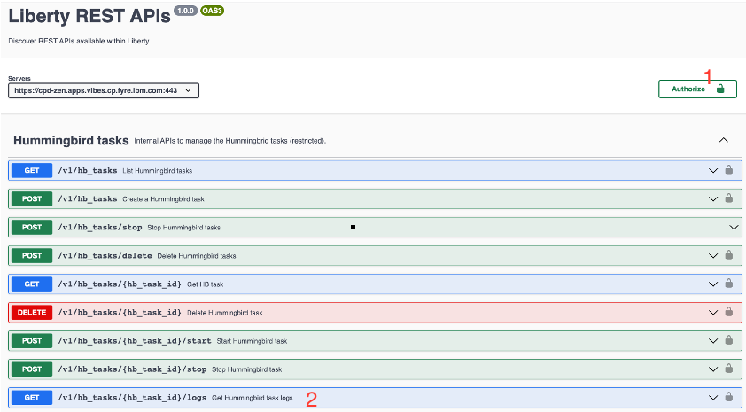

# Troubleshooting - Metadata Enrichment - Profiling
## Prods 

```
$ oc get pod | grep mde
wkc-mde-service-manager-78d674c7d4-x5l4z                     1/1     Running     0               26d

$ oc get pods | grep "wdp-profiling-"
wdp-profiling-66f8475bb8-fgblj                               0/1     Running                 985        15d
wdp-profiling-7675464d6d-9lmjl                               0/1     Running                 2629       40d

$ oc get pod | grep wkc-term-assignment 
wkc-term-assignment-5698b87dbc-f5skx                         1/1     Running     0               27d

Also "finley-ml*" pods
```

## Logs
Get all profiling related appliction logs from each `wdp-profiling` pods
```
$ oc rsh <wdp-profiling-*> bash
bash-4.4$ cd /logs
bash-4.4$ ls -l

total 1024
-rw-r-----. 1 1000650000 root 329937 Oct 18 19:45 messages.log
-rw-r-----. 1 1000650000 root 349125 Oct 18 19:45 trace.log
```
## Collect Hummingbrid Job Logs using API Explorer 
1. Generate the authentication token 
```
curl -X GET https://<CPD_HOST>/v1/preauth/validateAuth -H 'Cache-Control: no-cache' -H 'Content-Type: application/json'  -H 'username: <cpdUserName>' -H 'password: <cpdUserPassword>' --insecure
```
2. Go to Hummingbrid tasks explorer from web browser
```
https://<CPD_HOST>/v2/data_profiles/api/explorer/#/Hummingbird%20tasks/getHbTaskLogs
```

